# Проектирование способов взаимодействия с приложением

## Список интерфейсов 

- **🔥 Неавторизованный пользователь (Гость)**:
    - 1.Начальная страница
    - 2.Страница входа
    - 3.Страница регистрации
    - 4.Страница доступных распорядков
- **🔥 Авторизованный пользователь**:
    - 5.Новости
    - 6.Личная страница
    - 7.Личная страница другого пользователя
    - 8.Страница для редактирования профиля
    - 9.Страница результатов фильтра
    - 10.Страницу отслеживания
    - 11.Уведомления
    - 12.Определённый распорядок
    - 13.Определённый распорядок другого пользователя
    - 14.Страница для редактирования распорядка
    - 15.Определённое упражнение
    - 16.Список упражнений
- **🔥 Админ (Это супер-пользователь, который может получить доступ к еще одному интерфейсу)**
    - 17.Личная страница других пользователей глазами администратора

## Эскизы интерфасов

- **🔥 Неавторизованный пользователь (Гость)**:
  - 1.Начальная страница
    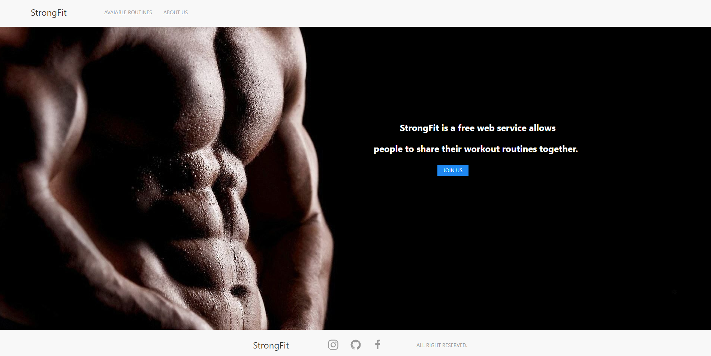
  - 2.Страница входа
    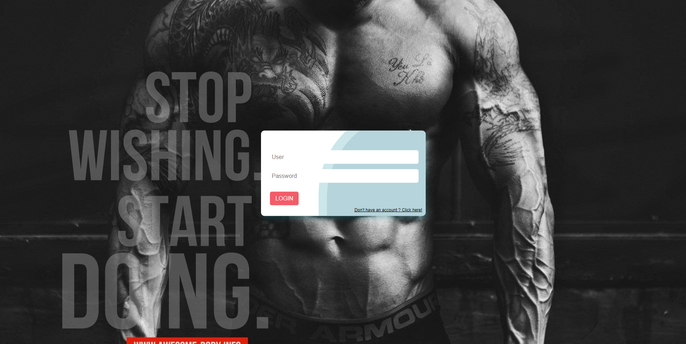
  - 3.Страница регистрации
    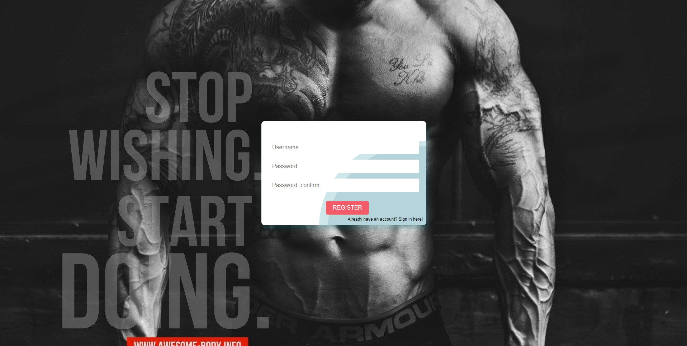
  - 4.Страница доступных распорядков
    
- **🔥 Авторизованный пользователь**:
  - 5.Новости
    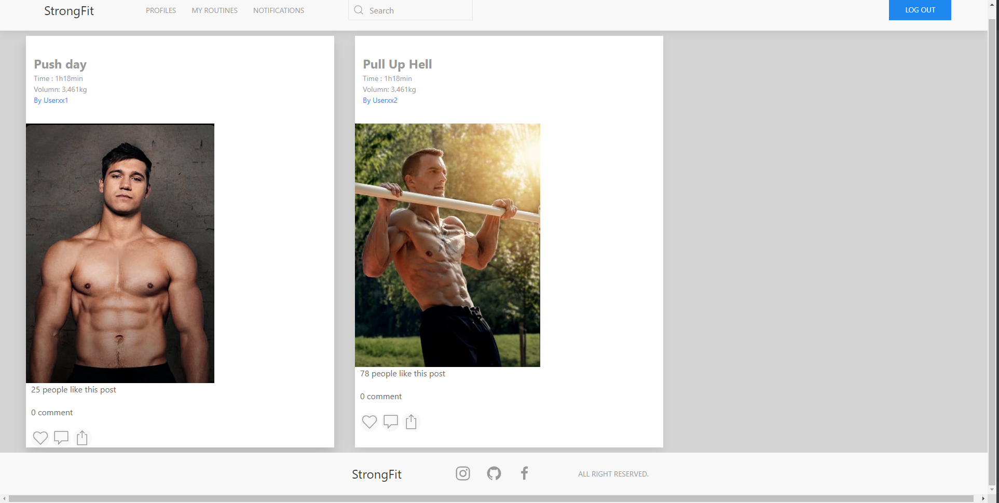
  - 6 и 7.Личная страница
    - Своя личная страница
    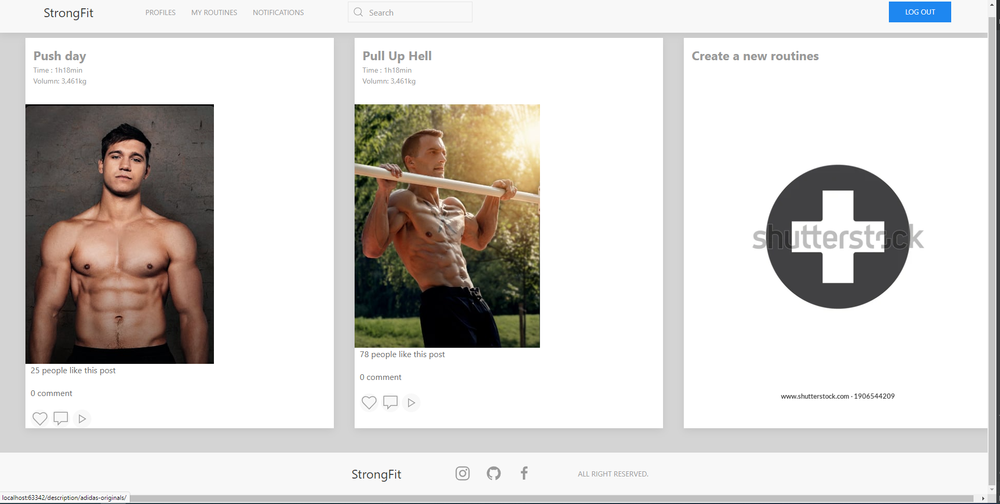
    - Личная страница другого пользователя (Не может редактировать информацию, но может подписаться)
    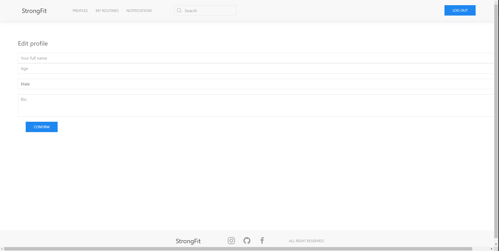
  - 8.Страница для редактирования профиля
    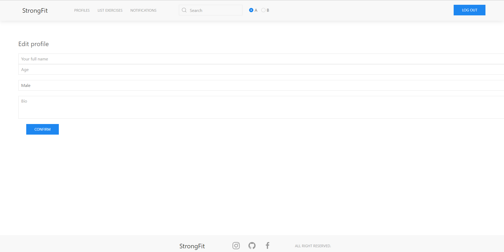
  - 9.Страница результатов фильтра
    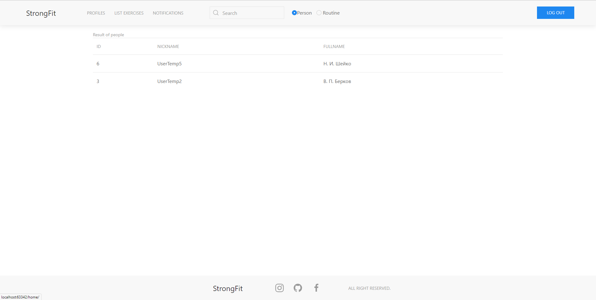
  - 10.Страницу отслеживания
    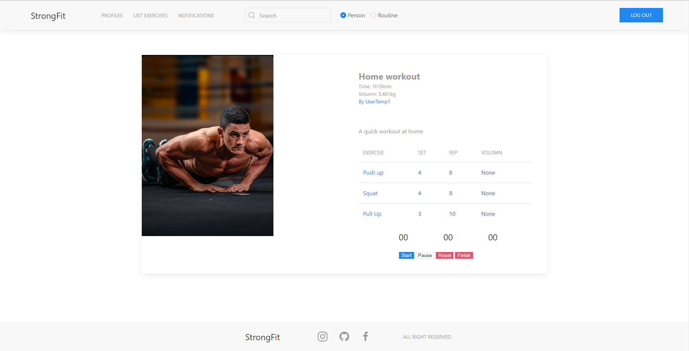
  - 11. Уведомления
    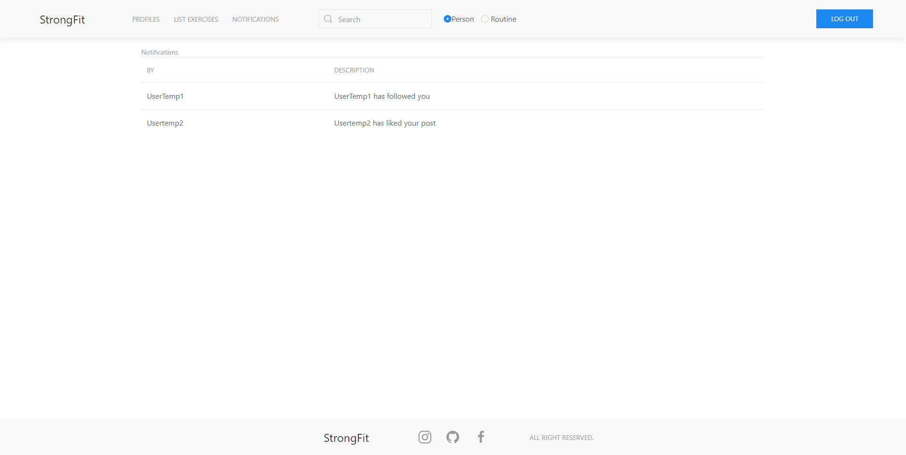
  - 12.Определённый распорядок
    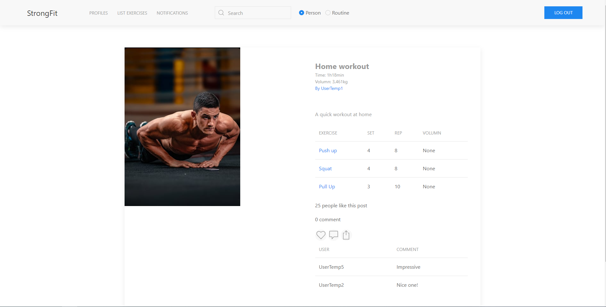
  - 13.Определённый распорядок другого пользователя
  
  - 14.Страница для редактирования распорядка
    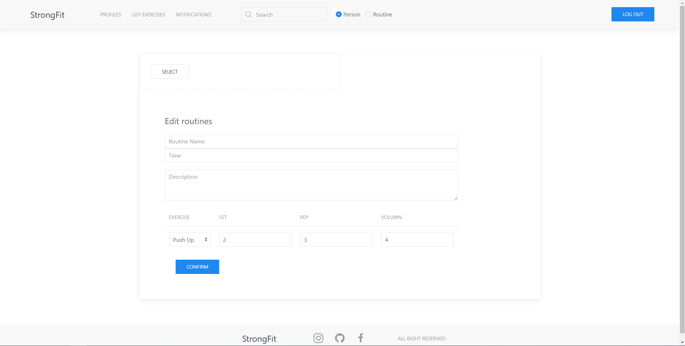
  - 15.Определённое упражнение
    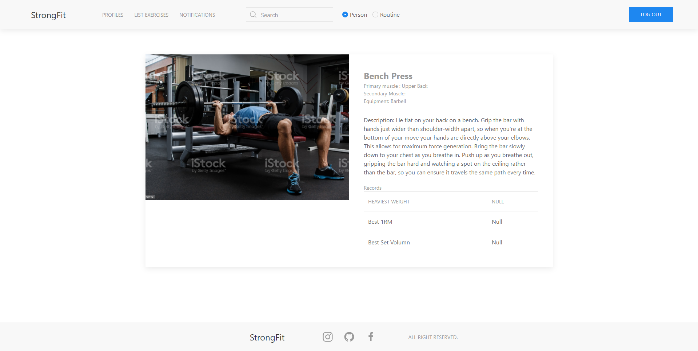
  - 16.Список упражнений
    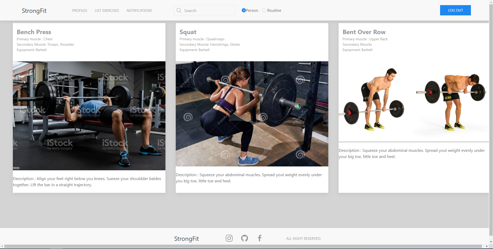
  
- **🔥 Админ (Это супер-пользователь, который может получить доступ к еще одному интерфейсу)**
  - 17.Личная страница других пользователей глазами администратора 
    -Есть дополнительная кнопка, позволяющая администратору забанить пользователя (удалить его из базы данных)
    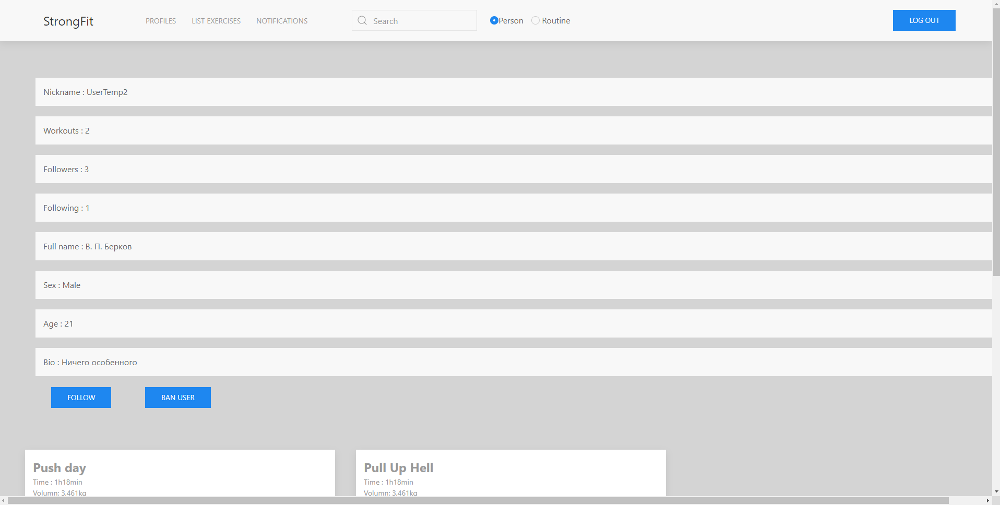
## Диаграмма интерфейсов
  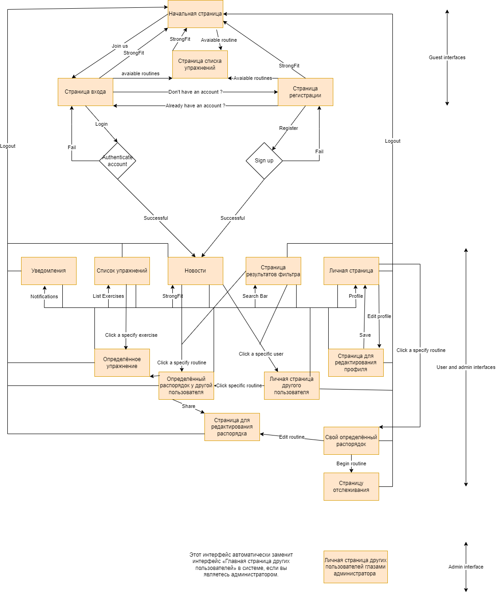
